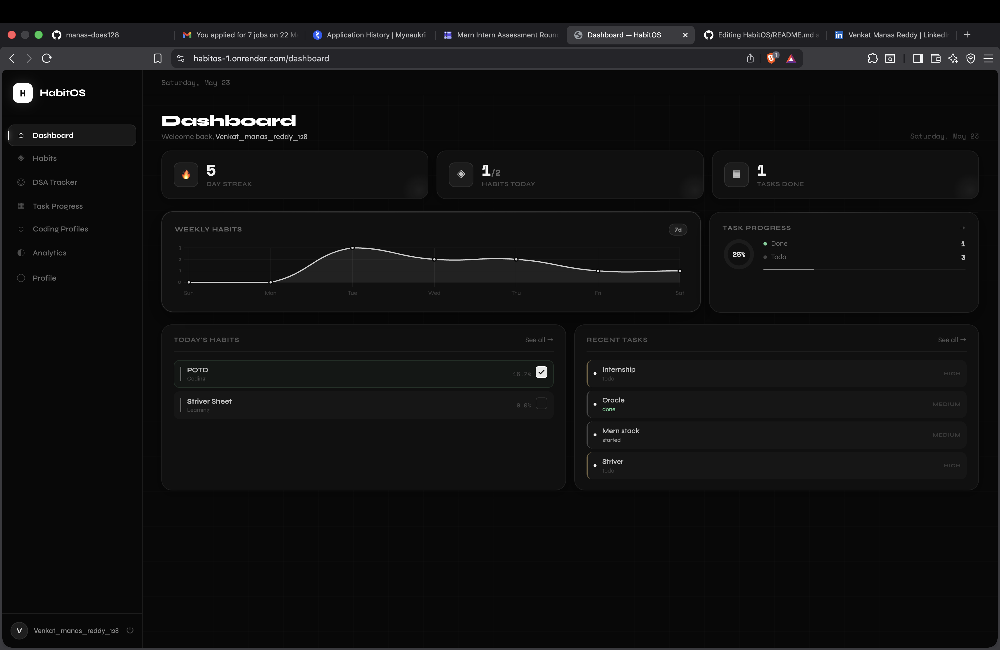
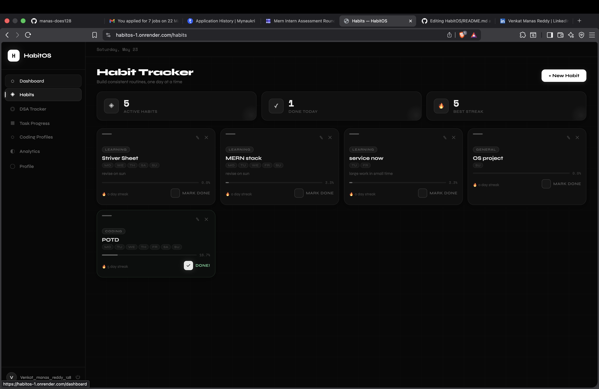
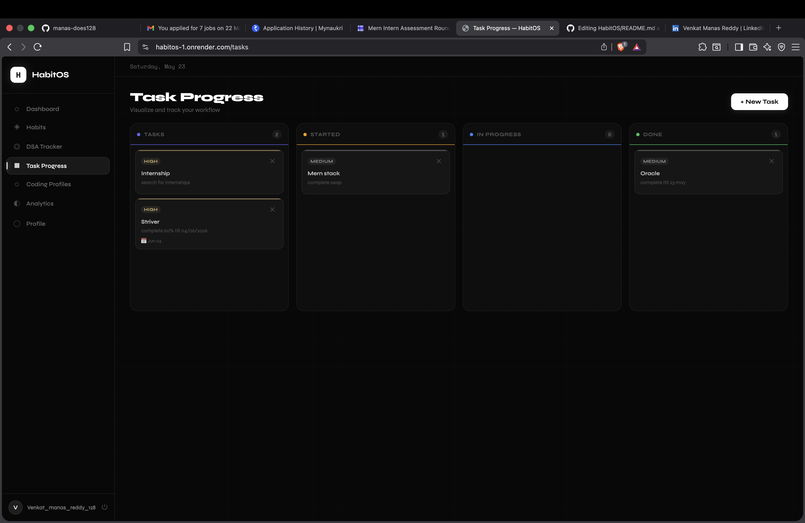
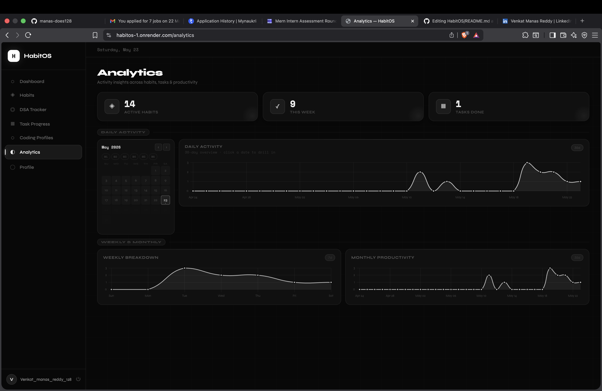

# HabitOS 🚀

> Productivity platform for students and developers to manage habits, DSA progress, coding profiles and tasks in one place.

<p align="left">
  
  
  
  
</p>

## 📑 Table of Contents

- [📸 Preview](#-preview)
- [🌐 Live Demo](#-live-demo)
- [🚀 Features](#features)
- [🛠 Tech Stack](#tech-stack)
- [⚙️ Setup](#setup)
- [📂 Project Structure](#project-structure)
- [🗄 MongoDB Collections](#mongodb-collections)
- [🔌 API Endpoints](#api-endpoints)
- [📜 License](#license)
## 📸 Preview

## 📸 Preview

<p align="center">
  
  
</p>

<p align="center">
  
  
</p>
## 🌐 Live Demo

🔗 Demo: https://habitos-1.onrender.com

---

## 🚧 Project Status

✅ Active Development  
🚀 New features and improvements ongoing
## Features

- **Habit Tracker** — Daily habits with streaks, completion rates & calendar heatmap
- **DSA Tracker** — Log solved problems with difficulty, platform & topic tags
- **Kanban Board** — Drag-and-drop task management (Todo / In Progress / Done)
- **Coding Profiles** — Fetch live stats from GitHub, LeetCode & Codeforces
- **Analytics** — Charts for weekly/monthly habit activity, DSA progress, topics
- **Profile Page** — Stats overview and account settings

## Tech Stack

| Layer | Technology |
|-------|-----------|
| Backend | Flask (Python 3.10+) |
| Database | MongoDB Atlas + PyMongo |
| Auth | bcrypt + Flask Sessions |
| Frontend | HTML5, CSS3, Vanilla JS |
| Charts | Chart.js |

## Setup

### 1. Clone & Install

```bash
git clone <repo-url>
cd HabitOS
pip install -r requirements.txt
```

### 2. Configure Environment

Copy `.env` and fill in your values:

```env
MONGO_URI=mongodb+srv://<user>:<pass>@cluster0.xxxxx.mongodb.net/habitos?retryWrites=true&w=majority
SECRET_KEY=your-super-secret-key
FLASK_ENV=development
FLASK_DEBUG=1
```

**MongoDB Atlas setup:**
1. Go to [mongodb.com/cloud/atlas](https://mongodb.com/cloud/atlas) and create a free cluster
2. Create a database user
3. Whitelist your IP (or use `0.0.0.0/0` for dev)
4. Copy the connection string into `MONGO_URI`

### 3. Run

```bash
python app.py
```

Visit `http://localhost:5000`

## Project Structure

```
HabitOS/
├── app.py                  # App factory
├── requirements.txt
├── .env                    # Environment config
├── routes/                 # Flask blueprints
│   ├── auth_routes.py
│   ├── dashboard_routes.py
│   ├── habit_routes.py
│   ├── task_routes.py
│   ├── dsa_routes.py
│   ├── coding_routes.py
│   ├── analytics_routes.py
│   └── profile_routes.py
├── models/                 # MongoDB document schemas
├── utils/                  # DB, auth, analytics helpers
├── templates/              # Jinja2 HTML templates
└── static/                 # CSS & JS assets
```

## MongoDB Collections

| Collection | Purpose |
|-----------|---------|
| `users` | Account data |
| `habits` | Habit definitions + completion dates |
| `tasks` | Kanban tasks |
| `dsa_problems` | Solved DSA problems |
| `coding_profiles` | Platform usernames + fetched stats |

## API Endpoints

| Method | Route | Description |
|--------|-------|-------------|
| POST | `/habits/complete/<id>` | Toggle today's completion |
| POST | `/tasks/add` | Add new task (JSON) |
| POST | `/tasks/update/<id>` | Update task status (drag-drop) |
| GET | `/coding-profiles/fetch/<id>` | Refresh platform stats |
| GET | `/dsa/stats` | DSA stats JSON |
| GET | `/analytics/data` | Analytics data JSON |

## License
## 📸 Preview

### Dashboard


### Habit Tracker


### Task Progress


### Analytics

MIT
